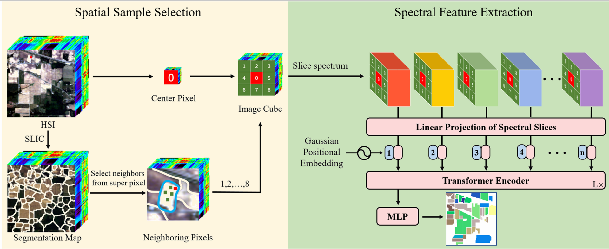

# Spectral Transformer with Dynamic Spatial Sampling and Gaussian Positional Embedding for Hyperspectral Image Classification
## Framework

## Enveronment

`conda create -n HSI python=3.7.11`

`conda activate HSI`

`pip install -r requirements.txt`

## Attention
HSI cube is generated from superpixel region. It is time-consuming when generating in each batch. To speed up the dataload process, we generate the HSI cube before training network and all cube is storaged in SLIC_samples.npy.

## Usage
1. generation of superpixel region

    we use matlab to generate superpixel region. The code is in matlab_code dir.

2. normal cube generation version

    train:  `python train_IP_normal.py`

    test:   `python test_IP_normal.py`

3. cube generated from superpixel region
    
    2.1 generate while training

    train:  `python train_IP_speed_normal.py`

    test:   `python test_IP_speed_normal.py`

    2.2 generate before training

    generate `python prepare_data.py`

    train:  `python train_IP_speed_up.py`

    test:   `python test_IP_speed_up.py`

## TODO
1. Add article link 
2. Upload code (ing)
